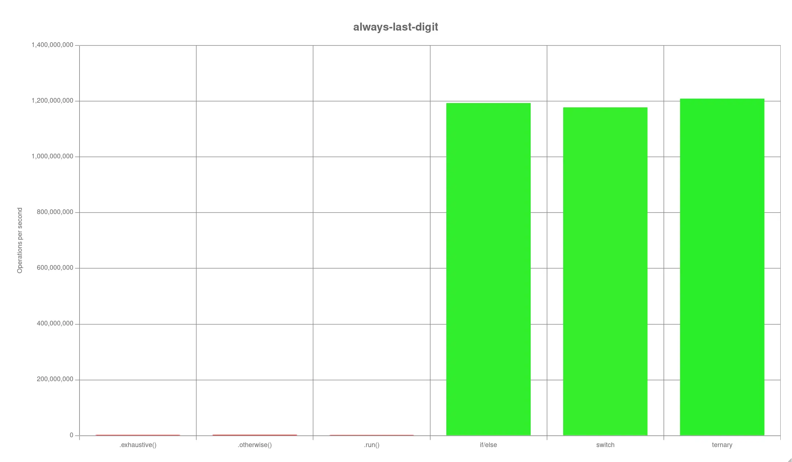
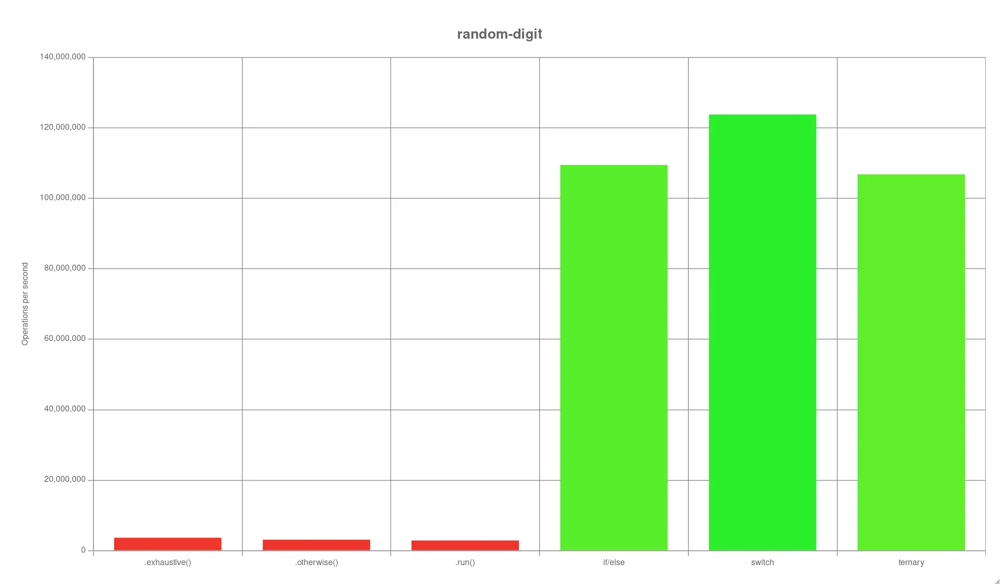
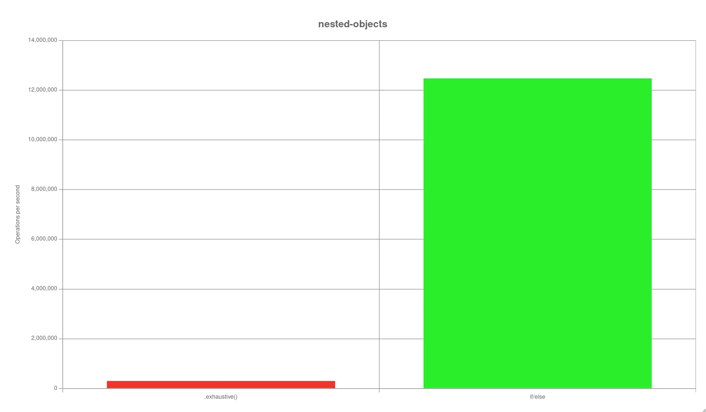

# Usage

```
npm install
npm run test
```

# Results

tested on:

- Ubuntu 22.04 (linux 6.5.0-44-generic, amd64)
- [node](https://nodejs.org) v21.6.2
- [ts-pattern](https://github.com/gvergnaud/ts-pattern) v5.0.1
- [TypeScript](https://github.com/microsoft/TypeScript) v5.1.6

## [Always last digit](./tests/always-last-digit.mts)

```
Running "always-last-digit" suite...
Progress: 100%

  .exhaustive():
    2 078 568 ops/s, ±5.44%       | 99.83% slower

  .otherwise():
    2 479 327 ops/s, ±3.90%       | 99.79% slower

  .run():
    1 722 901 ops/s, ±4.86%       | slowest, 99.86% slower

  if/else:
    1 192 882 513 ops/s, ±0.39%   | 1.31% slower

  switch:
    1 177 491 993 ops/s, ±0.45%   | 2.59% slower

  ternary:
    1 208 765 630 ops/s, ±0.25%   | fastest

Finished 6 cases!
  Fastest: ternary
  Slowest: .run() 
```



## [Random digit](./tests/random-digit.mts)

```
Running "random-digit" suite...
Progress: 100%

  .exhaustive():
    3 597 781 ops/s, ±1.91%     | 97.09% slower

  .otherwise():
    3 072 774 ops/s, ±4.34%     | 97.52% slower

  .run():
    2 837 388 ops/s, ±3.67%     | slowest, 97.71% slower

  if/else:
    109 463 541 ops/s, ±2.05%   | 11.56% slower

  switch:
    123 764 577 ops/s, ±1.76%   | fastest

  ternary:
    106 746 704 ops/s, ±2.28%   | 13.75% slower
```



## [Nested objects](./tests/nested-objects.mts)

```
Running "nested-objects" suite...
Progress: 100%

  .exhaustive():
    295 852 ops/s, ±2.78%      | slowest, 97.63% slower

  if/else:
    12 475 090 ops/s, ±2.17%   | fastest

```


